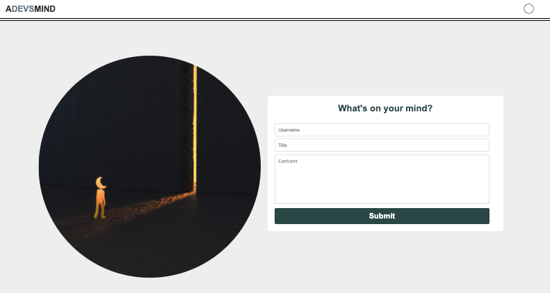
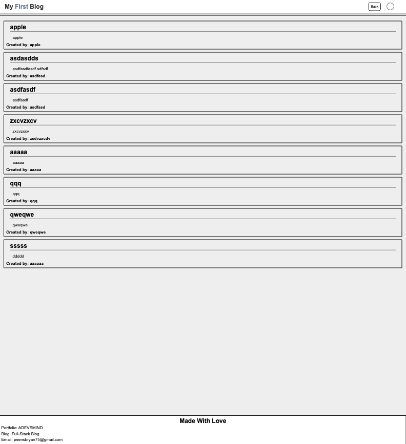
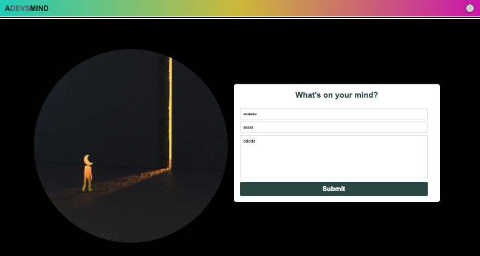
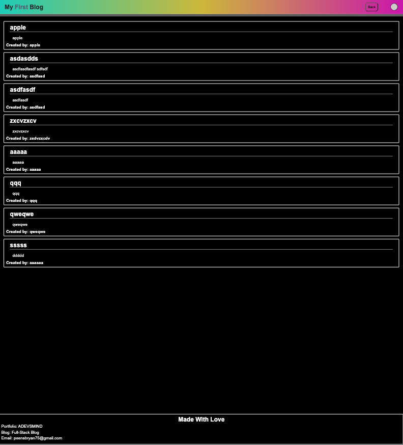

# Personal Blog Page

## Table of Contents

- [Demo and Code](#links)
- [Description](#description)
- [Features](#features)
- [Expected Output](#expected)
- [License and Usage](#license)
- [Contact Me](#contact)

## Links
* Link to live [personal blog](https://bryanpeens.github.io/personal-blog/index.html)
* Link to github [repo](https://github.com/BryanPeens/personal-blog)

## Description

This project is a simple developer blog web application that allows users to create, display, and view blog data using JavaScript, HTML, and CSS.

## Features

- Creating Blog Post Data: Users can input blog details such as username, blog title, and blog content using form inputs.

- Displaying Blog Data: The application collects and displays the post data.

- Dark and Light Mode: Application can switch between dark and light mode using javascript.

The project utilizes JavaScript for logic implementation, HTML for structure, and CSS for styling. It employs event listeners to trigger actions like collecting blog data when the "Submit" button is clicked. Additionally, it features a toggle switch to switch between dark and light mode.

## Expected

### Browser Output:
- In the web browser, the user is prompted to create a blog post.
- The displayed output should be as follows

#### Light Mode:

#### Dark Mode:

## License

## Contact
- Click here to [Contact Me](mailto:peensbryan75@gmail.com)